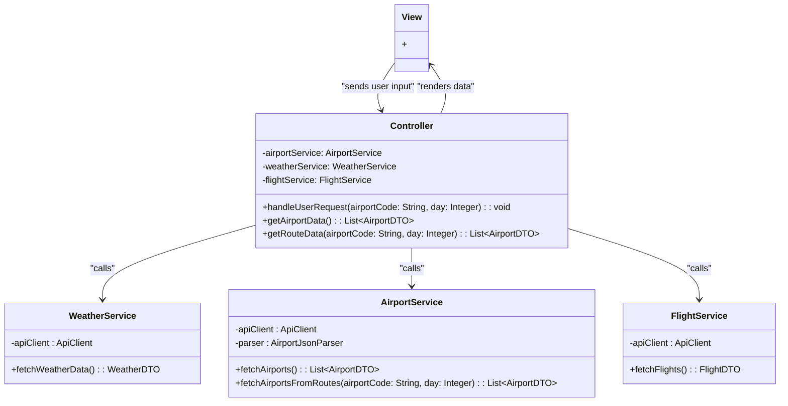
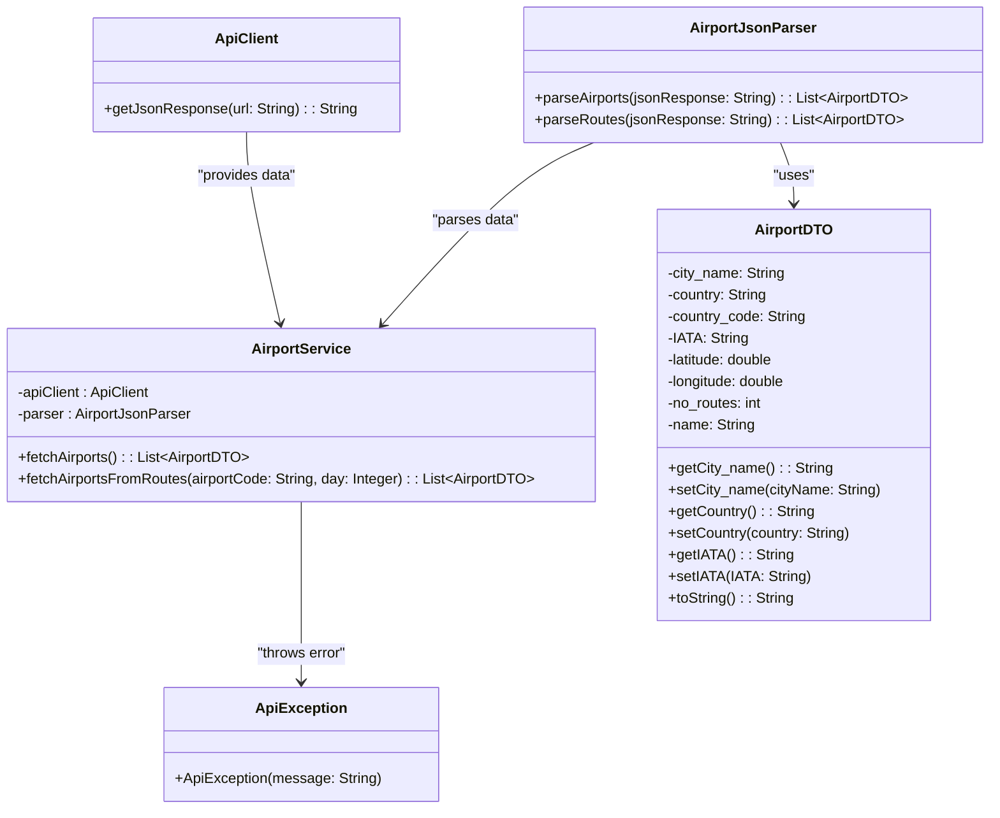

# Design Document <!-- omit in toc -->

## Table of Contents <!-- omit in toc -->

- [1. Introduction](#1-introduction)
  - [1.1 Purpose and Scope](#11-purpose-and-scope)
  - [1.2 Goals](#12-goals)
- [2. Requirements Specification](#2-requirements-specification)
  - [2.1 Functional Requirements](#21-functional-requirements)
  - [2.2 Non-Functional Requirements](#22-non-functional-requirements)
- [3. Architecture Design](#3-architecture-design)
  - [3.1 General Architecture Overview](#31-general-architecture-overview)
    - [3.1.1 Airport service layer class diagram](#311-airport-service-layer-class-diagram)
  - [3.2 Technologies and Tools](#32-technologies-and-tools)
  - [3.3 Backend desing](#33-backend-desing)
    - [3.3.1 WeatherService](#331-weatherservice)
- [4. User Interface Design](#4-user-interface-design)
  - [4.1 Use Cases](#41-use-cases)
    - [Use Case 1: Search for Flights](#use-case-1-search-for-flights)
    - [Use Case 2: View Search Results](#use-case-2-view-search-results)
    - [Use Case 3: Filter and Sort Flight Results](#use-case-3-filter-and-sort-flight-results)
  - [4.2 User Interface Prototype](#42-user-interface-prototype)
- [5. Integration with External Services](#5-integration-with-external-services)
  - [5.1 API Description](#51-api-description)
    - [5.1.1 Weather API](#511-weather-api)
    - [5.1.3 Airport API](#513-airport-api)
  - [5.2 Data Integration and Visualization](#52-data-integration-and-visualization)
- [6. Testing](#6-testing)
  - [6.1 Testing Strategy](#61-testing-strategy)
- [7. Project Management and Timeline](#7-project-management-and-timeline)
  - [7.1 Project Management Tools](#71-project-management-tools)
- [8. Use of AI in Project Design and Implementation](#8-use-of-ai-in-project-design-and-implementation)

# 1. Introduction

**Project Name**: COMP.SE.110 "Quick Vacation on a Budget"

**Project Team**:

- Otto Haarahiltunen
  - Weather API
- Vilppu Tupeli
  - Flight API
- Eero Hakanen
  - Airports API
- Niilo Jaakkola
  - Frontend

**Summary**: A last-minute travel scanner based on price, dates, and desired weather conditions.

## 1.1 Purpose and Scope

The purpose of the software is to suggest the cheapest direct flights to different destinations from the user's selected airport and time frame. The found flights are sorted by price and local weather. The user can then choose their preferred option and proceed to a website where they can book the flight.

## 1.2 Goals

Short-term goals include enabling the program to offer reasonable options.

# 2. Requirements Specification

## 2.1 Functional Requirements

- **Selecting search criteria**: The user must be able to select the travel budget, departure date, return date, and airport.

- **Data visualization**: The user should be able to view map-based visualizations of destinations, weather, and prices.

## 2.2 Non-Functional Requirements

- **Performance**: The application must operate at a sufficient speed.

# 3. Architecture Design

## 3.1 General Architecture Overview

The application will be implemented as a web application following the MVC principle. The Front-End is responsible for data visualization and user interface functionality, while the business logic is handled in the Back-End. A layered architecture is employed in the Back-End to clarify structure and facilitate task distribution and testing. The class diagram below illustrates the structure of the Back-End and the relationships between different layers.



[Class Diagram](https://drive.google.com/file/d/1OiQVkGx7B5HnSlQVauICjwz9y3TbM1ZT/preview)

### 3.1.1 Airport service layer class diagram



## 3.2 Technologies and Tools

- **Frontend**: HTML/CSS/JS

- **Backend**: Java with Maven, Spring Boot

## 3.3 Backend desing
  The backend is divided into three services, with a single controller that integrates them.

### 3.3.1 WeatherService
  The WeatherService is designed to manage connection to openweathermap API and query forecast's based on location coordinates.
  It consist the respose and DTO classes whom represent the data received from API.
  - Constructor that takes the latitude and longitude. 
    This choice was made because api returns forecast's based on location so every location should have their own instance of the class.
  - LoadForeCasts() tries to access the forecast api and load the forecasts for the next five days. Return value tells did the request succeed.
    This choice comes because we don't want to throw error on GetForecastForDate() in case connection is not made. We would like to see it beforehand and just skip the forecast loading in that case. It is also possible that we would like to get forecast for multiple days on given location. It would not make sense to call the API many times for the data we already have queried.
  - GetForecastForDate(LocalDate date) takes a date wanted to get the forecast for and returns ForecastDTO containing information about weather for that day.
    In case there is no forecast for the day given as parameter this does return the current days forecast. SHOULD NOT BE CALLED IF LoadForeCast does not succeed.
    Need for this function is quite obvious from previous functions.
    
  WEATHER_API_URL string is also exposed for testing purpose.

  Internally WeatherService uses okhttp3 and gson to retrieve and deserialize data.


# 4. User Interface Design

## 4.1 Use Cases

### Use Case 1: Search for Flights

**Description**:  
The user wants to search for available flights based on their selected departure airport, budget, and departure date.

**Precondition**:  
The user has access to the application interface.

**Steps**:

1. The user opens the application.
2. The user selects a departure airport from the dropdown list.
3. The user sets a budget using the slider to indicate the maximum amount they are willing to spend on a flight.
4. The user selects a departure date using the date picker.
5. The user clicks the "Search" button.
6. The system processes the request and displays a list of available flights based on the criteria.

**Postcondition**:  
The application returns a list of flights, showing information such as price, weather at the destination, and the flight availability.

---

### Use Case 2: View Search Results

**Description**:  
The user reviews the search results to find the most suitable flight option.

**Precondition**:  
The user has conducted a search by selecting airport, budget, and dates.

**Steps**:

1. The system presents the user with a list of destinations that meet the search criteria.
2. The user can see details of each flight, including:
   - Destination (e.g., Malaga, London).
   - Weather at the destination (e.g., 24°C and sunny for Malaga).
   - Flight price (e.g., 123€ for Malaga).
   - A heart icon to mark favorite destinations.
3. A map is displayed alongside the flight results, showing the geographical location of each destination.
4. The user can click on the destination card for more details or to proceed with booking.

**Postcondition**:  
The user can choose a flight and view detailed information or continue searching for other options.

---

### Use Case 3: Filter and Sort Flight Results

**Description**:  
The user wants to refine the search results by adjusting filters such as budget or dates, or sorting by criteria such as best match or price.

**Precondition**:  
The user has performed a search and is viewing the search results.

**Steps**:

1. The user adjusts the budget slider to narrow down the flight options within their price range (e.g., from $0 to $125).
2. The user can change the departure and return dates using the date pickers.
3. The user can select a sorting option (e.g., "Best Match") from the dropdown menu to prioritize results by relevance or price.
4. The system updates the list of available flights according to the new criteria.

**Postcondition**:  
The search results are updated, showing only the flights that match the newly set budget, dates, or sorting order.

## 4.2 User Interface Prototype

[The user interface prototype.](https://www.figma.com/proto/3Z0nJM7AmZo1X4sag637eH/Prototype?node-id=32-54&node-type=canvas&t=vkOqLgQTHZ5XPx7T-0&scaling=min-zoom&content-scaling=fixed&starting-point-node-id=52%3A248)

# 5. Integration with External Services

## 5.1 API Description

**External APIs used**:

- **Weather API** - OpenWeatherMap

- **Flight Offers Search API** - Find Cheap Flights, 400+ Airlines | Amadeus for Developers

- [Airport api](https://www.flightsfrom.com/)

### 5.1.1 Weather API

Weather API is used to fetch forecast for the next five days based on selected the destination airport coordinates.

**Fetching forecasts**

Forecasts are fetched from url https://api.openweathermap.org/data/2.5/forecast?lat={latitude}&lon={longitude}&appid={api-key}&units=metric.
Response contains a list of forecast for the next five days. Each day has a forecast for every three hours.

Example result:

```json
{
  "cod": "200",
  "message": 0,
  "cnt": 40,
  "list": [
      {
          "dt": 1728734400,
          "main": {
              "temp": 10.32,
              "feels_like": 9.89,
              "temp_min": 10.3,
              "temp_max": 10.32,
              "pressure": 1019,
              "sea_level": 1019,
              "grnd_level": 764,
              "humidity": 95,
              "temp_kf": 0.02
          },
          "weather": [
              {
                  "id": 804,
                  "main": "Clouds",
                  "description": "overcast clouds",
                  "icon": "04d"
              }
          ],
          "clouds": {
              "all": 95
          },
          "wind": {
              "speed": 3.53,
              "deg": 21,
              "gust": 4.34
          },
          "visibility": 10000,
          "pop": 0,
          "sys": {
              "pod": "d"
          },
          "dt_txt": "2024-10-12 12:00:00"
      },
      .
      .
      .
  ]
}
  
```


### 5.1.3 Airport API

Airport API is used to fetch two types of data:

- fetch all airports, all airports are used to select departure airport
- fetch all flight connections from the chosen airport

**All airports**

Fetched from https://www.flightsfrom.com/airports. Response contains a list of airport objects.

<!-- Possible improvement to this design would be to search for airports ordered by nearest airport to the user. -->

Example result:

```json
{
  "response": {
    "airports": [
      {
        "city_name": "Aasiaat",
        "country": "Greenland",
        "country_code": "GL",
        "IATA": "JEG",
        "latitude": "68.7",
        "longitude": "-52.75",
        "no_routes": "10",
        "name": "Aasiaat"
      },
      .
      .
      .
    ]
  }
}
```

**Airport routes**

All direct flight routes (_app uses only direct connections_) are fetched from https://www.flightsfrom.com/api/airports/{airport_code}.

If user picks a specific departure date then flight connections should be filtered with parameter day. https://www.flightsfrom.com/api/airports/{airport_code}?&days=day{day_number} where day numbers are based on weekdays mon-su => 1-7.

<!-- There is a possible edge case where an airport would have a flight to some airport but there would be no return flights. For example there is direct flight form A->B but no flight from B->A. This can be explored later. -->

Example result:

```json
{
  "response": {
    "routes": [
      {
        "iata_from": "TMP",
        "iata_to": "RIX",
        "city_name_en": "Riga",
        // TODO are these weekdays which contain flights needed?
        // In this example there is flights
        "day1": "yes",
        "day2": "yes",
        "day3": "yes",
        "day4": "yes",
        "day5": "yes",
        "day6": "yes",
        "day7": "upcoming",
        // Not sure what price this indicates, maybe just don't use this ?
        "price": "42",
        "airport": {
          "IATA": "RIX",
          "latitude": "56.92208",
          "longitude": "23.979806",
          "city_name": "Riga",
          "name": "Riga International Airport",
          "display_name": "Riga (RIX), Latvia",
          "country_code": "LV",
          "country": "Latvia",
        },
        .
        .
        .
      }
    ]
  }
}
```

_NOTE: only relevant data shown in the example, the API returns more data_

## 5.2 Data Integration and Visualization

The application aims to integrate data from the aforementioned API calls and display it according to the prior user interface plan.

# 6. Testing

## 6.1 Testing Strategy

The testing strategy for the Front-End involves manual acceptance testing at the final stage, complemented with unit tests as needed. The focus of testing is on the Back-End, where unit tests and integration tests will be implemented for each layer to ensure the functionality of interfaces between the layers.

# 7. Project Management and Timeline

## 7.1 Project Management Tools

The progress of the project and task distribution will be tracked using [Github Projects](https://github.com/users/ottohh/projects/1). Internal group communication will be carried out via Telegram and Discord. Git and GitHub will be used for [version control](https://github.com/ottohh/COMP.SE.110). Figma will be used for UI design and prototyping.

# 8. Use of AI in Project Design and Implementation

AI was utilized in brainstorming and finding potential APIs. It was also used to create the foundation of the documentation.

